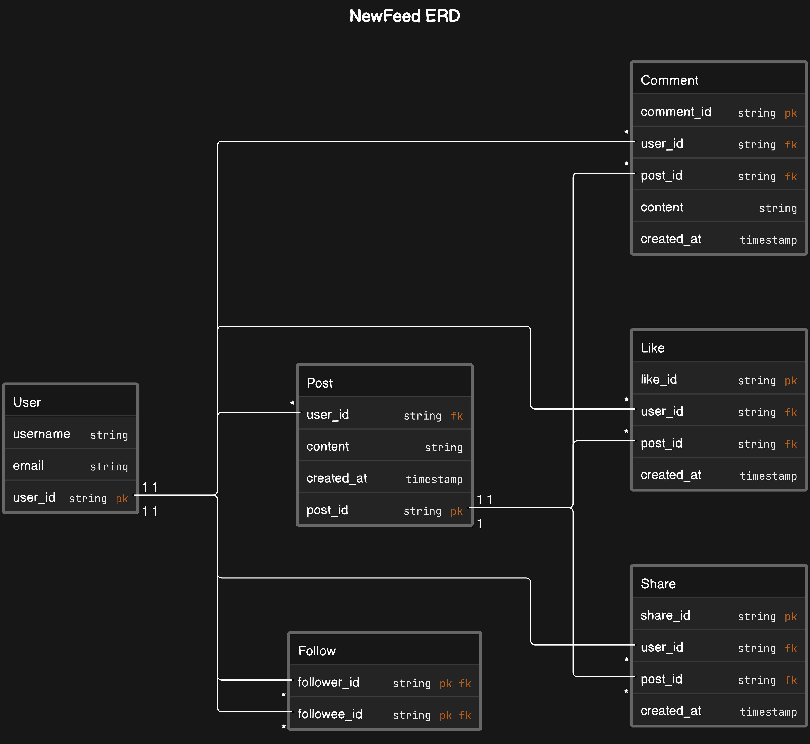

# NewFeed Microservice

This project is a simple microservice using Flask for a social media application with basic entities: User, Post, Comment, Like, Share, and Follow/Friendships.

## Table of Contents

- [Requirements](#requirements)
- [ERD Diagram](#erd-diagram)
- [SQL Implementation](#sql-implementation)
- [Python Microservice with Flask](#python-microservice-with-flask)
- [Usage](#usage)

## Requirements

The main focus of the business is to create a simple newsfeed app with the following entities:

1. User
2. Post
3. Comment
4. Like
5. Share
6. Follow/Friendships

## ERD Diagram



## SQL Implementation

Include the SQL scripts for creating the database schema.

## Python Microservice with Flask

Include the Python code for your Flask microservice.

## Usage

Follow these steps to set up and run the microservice:

### Prerequisites

- Python installed (version X.X.X)
- MySQL server installed and running
- Git installed

### Getting Started

1. Clone the repository:

   ```bash
   git clone https://github.com/yourusername/social-media-microservice.git
   ```

2. Install dependencies:

   ```bash
   cd social-media-microservice
   pip install -r requirements.txt
   ```

3. Configure MySQL:

   - Create a database and configure the `config.py` file with your database credentials.

4. Run the microservice:

   ```bash
   python app.py
   ```

5. The microservice should be running at [http://localhost:5000](http://localhost:5000). You can now use the provided endpoints.
